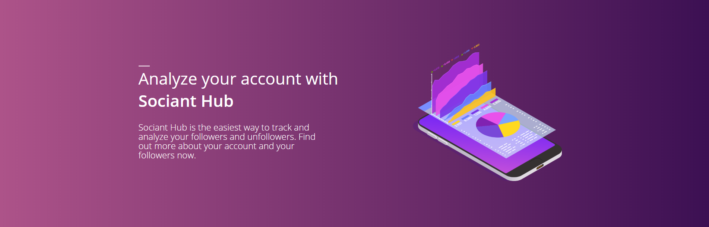

<h1 align="center">
    <a href="https://hub.sociant.de" target="_blank">
        
    </a>
</h1>

# Sociant Hub

Sociant Hub is an mini project for tracking and analyzing Twitter Followers on top of [Symfony](https://symfony.com/).

This project was created originally for private use to test the still existing twitter features. Due to some requests I worked on the project as a public accessible website, [Sociant Hub](https://hub.sociant.de).

This project uses [TwitterOAuth](https://github.com/abraham/twitteroauth) by [abraham](https://github.com/abraham) for requests and [Firebase Bundle](https://github.com/kreait/firebase-bundle) by [kreait](https://github.com/kreait) and is based on Symfony 5.0.

# Installation

To install Sociant Hub for your own use make sure you use [PHP 8.0](https://www.php.net/releases/8.0/en.php), a [MySQL Database](https://mysql.com/) or higher, [NodeJS 16](https://nodejs.org/en/) with npm and have [Composer](http://packagist.org/) installed.

### 1. Clone the repository

Clone with HTTPS: https://github.com/Sociant/Sociant-Hub.git

Clone with SSH: git@github.com:Sociant/Sociant-Hub.git

### 2. Install dependencies with composer

Run `composer require`

### 3. Install dependencies with npm

Run `npm install` or `yarn install`

Warning: Sociant Hub uses fontawesome 5 pro packages which require a subscription.

### 4. Configure the application

Copy the contents of the given `.env` file into a new file called `.env.local`. To operate Sociant Hub properly you should fill out every given field.

Field | Description | Values | Example
---  | --- | --- | ---
APP_ENV | Symfony Enviroment | `dev` or `prod` | dev
APP_SECRET | Random generated secret || 4Tuepn6UZkasRLqEbshLC2RX
MAILER_DSN | DSN Settings for E-Mail delivery || Please consider checking out the [Documentation](https://symfony.com/doc/current/mailer.html)
TWITTER_API_KEY | Public Twitter API Key || Please visit [Twitter Developer](https://developer.twitter.com/en/apps) for obtaining the key pair
TWITTER_API_SECRET_KEY | Secret Twitter API Key || Read above
TWITTER_CALLBACK_URL | Return URL after successful authentication || Read above
MOBILE_PLATFORM_SCHEMA | Schema Redirection after Login from mobile Device | socianthub://callback
FOLLOWER_LIMIT | Follower Limit for Follower Analytics | 70000

With the API-Integration Update Firebase is also added to the project. To configure the application correctly you have to
include the project-credentials.json from firebase into `[Project-Root]/config/project-credentials.json`

Firebase is included for Live-Notifications to connected mobile devices. You can find your project credentails under:

https://console.firebase.google.com/project/[your-project-id]/settings/serviceaccounts/adminsdk

Go to Firebase Admin SDK and click on generate new private key. (or use your already generated one) and copy the contents into your project-credentails.json

### 5. Run Symfony

You can either run symfony via console with `symfony server:start` or run it via Apache or Nginx. Visit [Configuring a Web Server](https://symfony.com/doc/current/setup/web_server_configuration.html) for more information.

### 6. That's it

Now you can Login from your given URL or local Port to visit your instance.

To automate requests you can add a cronjob for fetching the data automatically.

Example for Web Service in `/var/www/html` every 5 Minutes: 

```*/5 * * * * php /var/www/html/bin/console app:update-user 1>> /dev/null 2>&1```

Or you can update your data manually in the dashboard or for every user with `php bin/console app:update-user`.

Please consider that due to API limitations you can only update every user once per hour.

# Used Libraries

### Composer Libraries (PHP)
* [TwitterOAuth](https://github.com/abraham/twitteroauth) by [abraham](https://github.com/abraham)
* [Firebase Bundle](https://github.com/kreait/firebase-bundle) by [kreait](https://github.com/kreait)
* [DoctrineExtensions](https://github.com/beberlei/DoctrineExtensions) by [beberlei](https://github.com/beberlei)
* [CronBundle](https://github.com/Cron/Symfony-Bundle) by [cron](https://github.com/Cron)

### NPM Libraries (NodeJS)
* [FontAwesome](https://fontawesome.com/) by [Fortawesome](https://fontawesome.com/)
* [ApexCharts](https://github.com/apexcharts/apexcharts.js) by [ApexCharts](https://github.com/apexcharts)
* [Framer Motion](https://github.com/framer/motion) by [Framer](https://github.com/framer)
* [i18next](https://github.com/i18next/i18next) by [i18next](https://github.com/i18next)
* [React Router](https://github.com/remix-run/react-router) by [remix-run](https://github.com/remix-run)
* [Styled Components](https://github.com/styled-components/styled-components) by [styled components](https://github.com/styled-components)

# License

Sociant Hub is released under the [Apache-2.0](license.md) License

# Authors

Sociant Hub was created by [l9cgv](https://twitter.com/l9cgv) as Project for [SociantWD](https://twitter.com/SociantWD).

Thanks to [DeZio91](https://twitter.com/DeZio91) and [Marcel Malberg](https://twitter.com/TheCrealm) for testing out the application in beta state.

Thanks to everyone involved in version 1 and users of the Sociant Hub App. <3

Copyright © 2022 - Sociant WD